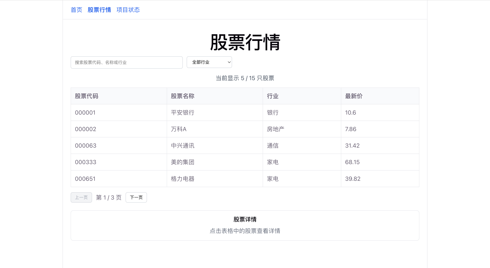
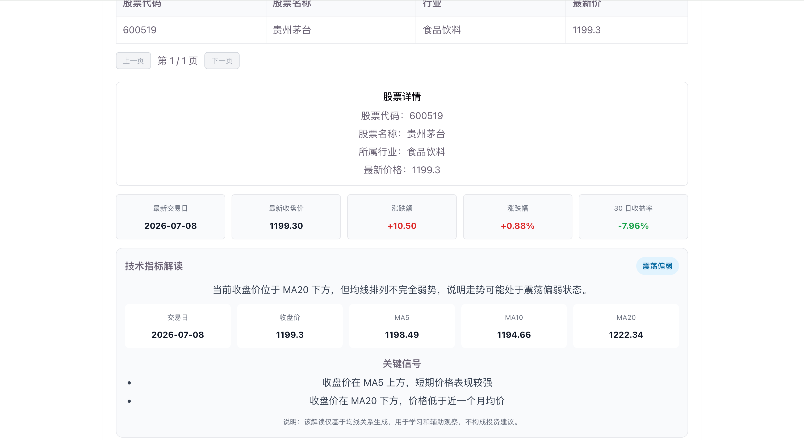
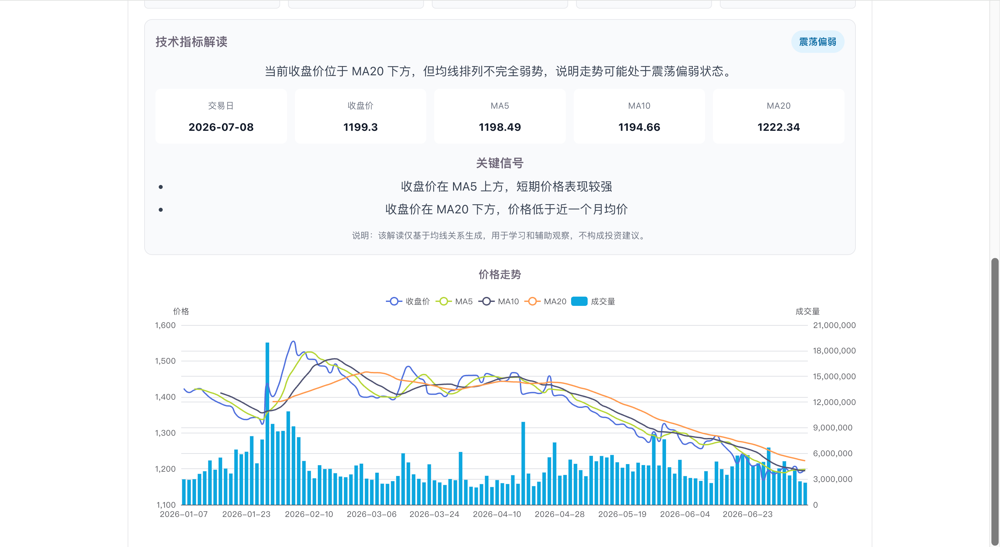
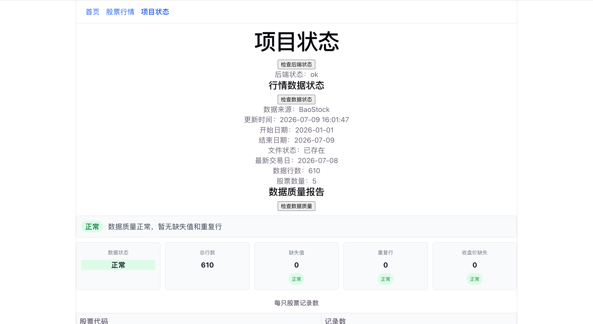
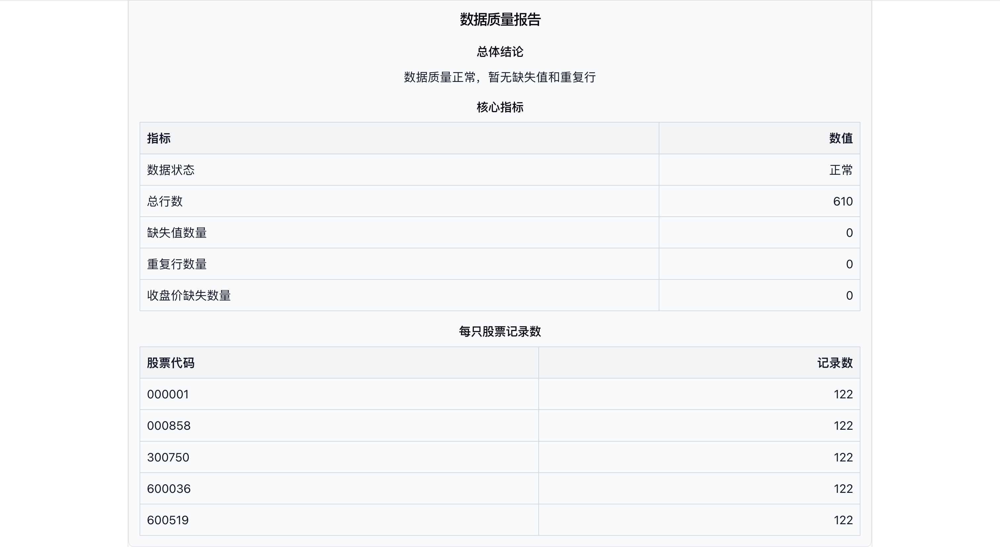

# Quant Research Copilot

一个基于 Vue3 + FastAPI + Python 数据处理的 AI 投资研究助手原型项目。

本项目围绕股票行情数据，完成了数据获取、数据质量检查、收益指标计算、技术指标计算、趋势解读和 Markdown 报告生成等功能，后续计划接入大模型生成投资研究报告。

## 项目亮点

- Vue3 + TypeScript 实现前端行情看板
- FastAPI 提供后端接口服务
- pandas 读取和处理 CSV 行情数据
- BaoStock / AKShare 作为行情数据源
- ECharts 展示股票价格、均线和成交量
- 支持 MA5、MA10、MA20 技术指标计算
- 支持技术指标趋势解读
- 支持数据状态检查和数据质量检查
- 支持数据质量 Markdown 报告生成、复制和下载
- 具备后续接入 AI 投资研究报告的扩展基础

## 项目截图

### 1. 股票行情列表

支持股票列表展示、关键词搜索、行业筛选和分页。

---

### 2. 股票详情与价格走势图

点击股票后，可以查看股票详情、历史收盘价走势、收益指标等信息。
系统会根据收盘价与均线关系，生成通俗的趋势解读和关键信号说明。

---

### 3. 技术指标图表

支持展示收盘价、MA5、MA10、MA20 等技术指标，用于观察股票短期和中期趋势。

---

### 4. 行情数据状态检查

支持查看当前行情数据来源、更新时间、数据区间、股票数量和数据行数。

---

### 5. 数据质量 Markdown 报告

支持生成数据质量报告，并提供 Markdown 渲染、复制和下载功能。

